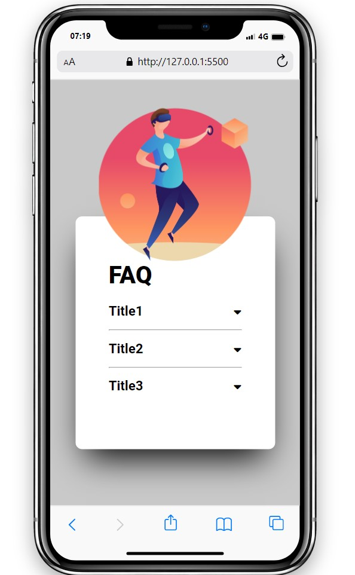

# Projeto Slider de imagens

O projeto é um FAQ Web interativo e responsivo.
Possui tres botões e  divs de texto.


<br>

# Visualização do Projeto

<br>

<br>


## Tecnologias utilizadas

- HTML     
- CSS   
- Javascript

## Como utilizar

1-clone para o projeto
```
git clone <url>
```

2-Acesse a pasta do projeto
```
cd repositorio-com-readme
```

## Sua Opinião Importa

Se você explorou O projeto e tem alguma observação, sugestão ou apenas deseja entrar em contato, por favor, compartilhe conosco. Valorizamos seu feedback e estamos constantemente buscando maneiras de melhorar. Seu insight é valioso e ajuda a aprimorar nosso projeto. Não hesite em nos contatar, mesmo que seja apenas para dizer "oi." Aguardamos ansiosamente seu contato e agradecemos sua participação em nossa jornada.


